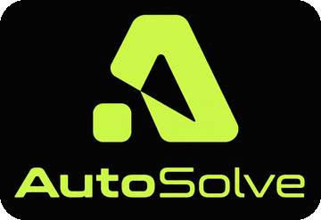

<!-- Header -->

  

  

  &nbsp;
  &nbsp;
  &nbsp;
  

---

## 👋 About me

I'm a **Backend Developer and AI Engineer** from **Tashkent, Uzbekistan** 🇺🇿.
My foundation is Python backend: APIs, databases, async services and background jobs. On top of that I'm building my skills in **AI engineering**, bringing LLMs into real products.

I don't only write code, I also build products and startups. I turn ideas into working systems: **SaaS**, **web platforms**, **CRM / ERP**, **Telegram bots and Mini Apps**.

- 💼 **Open to work** as a **Backend Developer**
- 🚀 Founder of **[AutoSolve](https://autosolve.uz)**, an IT agency building digital products for businesses
- 🤖 Currently going deeper into **AI engineering**: LLMs, AI agents, integrations
- 🌱 My stack keeps growing; new technologies land here as I master them
- 📍 Tashkent, Uzbekistan

---

## 🛠 Tech Stack

  

  
  
  
  
  
  
  
  
  
  

| Area | Technologies |
|---|---|
| **Backend** | Python · FastAPI · Django · Asyncio · Pydantic |
| **Databases** | PostgreSQL · SQLAlchemy · Alembic · Redis |
| **Background jobs** | Celery · Redis |
| **Bots** | aiogram · Telegram Mini Apps |
| **Auth & Testing** | JWT · Pytest |
| **DevOps & Tools** | Docker · Git · GitHub · Postman · Linux |
| **AI** | LLM integrations · AI agents *(in progress)* |

---

## 🚀 Projects

<table>
  <tr>
    <td width="200" align="center">
      
    </td>
    <td>
      <h3><a href="https://autosolve.uz">AutoSolve</a> — my IT agency</h3>
      

        Digital products for businesses in Uzbekistan, from idea to launch and support:
        websites, web platforms, <b>CRM systems</b>, business automation, <b>Telegram bots</b>
        and <b>AI solutions</b> with Payme / Click payment integration.
      

      
    </td>
  </tr>
</table>

**What I build:**
`SaaS` · `Web platforms` · `CRM / ERP` · `REST APIs` · `Telegram bots & Mini Apps` · `AI integrations`

📂 The rest of my projects are in my **[repositories](https://github.com/ali-middleweightchamp?tab=repositories)**.

---

## 📫 Let's connect

I'm open to **Backend Developer** roles, collaborations and interesting projects.
The fastest way to reach me is Telegram: <a href="https://t.me/xxw9595"> <b>@xxw9595</b></a>

  

